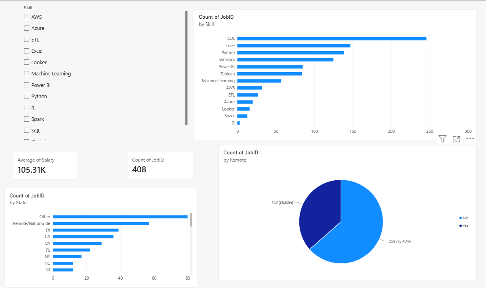

# Data Analyst Job Market Analysis (2024)

**What skills actually get you hired as a Data Analyst — and which ones pay the most?**

While applying for Data Analyst roles, I analyzed 400+ real "Data Analyst" job postings scraped from LinkedIn in 2024 to answer two questions: (1) which technical skills appear most often in job descriptions, and (2) which skills are associated with higher salaries. I used the findings to prioritize what to focus on in my own job search.

## Data Source

- **LinkedIn Job Postings dataset** (Kaggle), ~3.38 million postings collected in 2024
- Filtered down to postings with "Data Analyst" in the job title → **408 postings**
- Fields used: job title, company, location, salary (normalized to annual USD), remote status, and full job description text

## Tools Used

- **Python** (pandas) — data cleaning, filtering a 3.38M-row dataset in chunks, regex-based skill extraction from unstructured description text
- **SQL** (SQLite) — aggregation queries (GROUP BY, CASE WHEN, multi-column grouping) to analyze skill and salary patterns
- **Matplotlib** — static visualizations
- **Power BI** — interactive dashboard with a live skill filter, built on top of the same cleaned data

## Process

1. **Filtering at scale**: The raw dataset was too large to load into memory at once (~500MB), so it was processed in chunks of 200k rows, filtering for "data analyst" in the job title at each step.
2. **Skill extraction**: The dataset's built-in "skills" field only contained broad job-function categories (e.g. "Analyst," "IT"), not specific tools. To get real signal, I used regex pattern matching on the raw job description text to flag mentions of SQL, Excel, Python, Tableau, Power BI, Statistics, Machine Learning, AWS, Azure, ETL, Spark, and R.
3. **Salary normalization**: Salaries were reported in mixed formats (hourly vs. yearly). I used the dataset's pre-normalized annual salary field, available for 130 of the 408 postings (32%) — the rest did not disclose salary.
4. **SQL analysis**: Loaded the cleaned dataset into a SQLite database and wrote queries to cross-tabulate skill mentions against salary and location.

## Key Findings

**1. SQL is the most in-demand skill by a wide margin — mentioned in 60% of postings**, ahead of Excel (36%) and Python (34%).

**2. SQL is also associated with a real salary premium.** Postings mentioning SQL averaged **$111,815/year**, compared to $94,561 for postings that didn't — a gap of roughly $17,000.

**3. Excel correlates with lower salary.** Postings mentioning Excel averaged $101,811 vs. $108,407 for those that didn't — likely because Excel is disproportionately requested in more junior/entry-level roles.

**4. SQL + Python is the dominant baseline combo.** 72 postings required SQL and Python without any visualization tool, compared to only 19 postings that required SQL + Python + Tableau + Power BI together — suggesting visualization tools are often a "nice to have" layered on top of core querying/scripting skills, not a baseline requirement.

**5. Remote work is common.** 36% of postings (149/408) explicitly allowed remote work.

**6. Job concentration**: Outside of nationwide/remote listings, New York, NY had the highest concentration of postings (12), followed by Richmond, VA and Plano, TX.

**7. Tableau and Power BI aren't interchangeable, despite near-identical demand.** Both appear in ~21% of postings, but Tableau postings averaged $110,970/year (+$8,553 vs. postings without it), while Power BI postings averaged slightly *less* than postings without it ($101,836 vs. $106,971). A plausible explanation — not confirmed by this data alone — is that Power BI shows up more often in junior/operational reporting roles, similar to the Excel pattern above, while Tableau skews toward more analytics-heavy postings.

## Interactive Dashboard



Built a Power BI dashboard on top of this data — click any skill in the slicer to see job count, average salary, top states, and remote share update live.

## Takeaway

Based on this analysis, I prioritized strengthening my SQL skills first, since it's both the most commonly requested skill and the one most associated with higher pay — followed by Python and Tableau specifically as a differentiator, since Tableau showed a real salary premium in this data while Power BI did not, despite similar demand.

## Files in this repo

| File | Description |
|---|---|
| `analysis.ipynb` | Full notebook: filtering, cleaning, skill extraction, SQL analysis, charts |
| `data_analyst_with_skills.csv` | Cleaned dataset: 408 postings with extracted skill flags |
| `data_analyst_jobs.db` | SQLite database used for SQL analysis |
| `skill_demand_chart.png` | Chart: % of postings mentioning each skill |
| `salary_by_skill_chart.png` | Chart: average salary with vs. without each skill |
| `data_analyst_dashboard.pbix` | Interactive Power BI dashboard — open in Power BI Desktop to filter live |
| `dashboard_screenshot.png` | Preview of the dashboard in use |
| `requirements.txt` | Python dependencies |

## Running it yourself

```bash
pip install -r requirements.txt
```

The notebook expects the raw `postings.csv` from the [Kaggle LinkedIn Job Postings dataset](https://www.kaggle.com/datasets/arshkon/linkedin-job-postings) in the repo root (not included here — it's ~500MB). Everything downstream of that (the cleaned CSV, the SQLite db, and both charts) is already included, so you don't need the raw file just to explore the results.

## Limitations

- Sample size for salary analysis is modest (130 postings with disclosed salary) — findings are directional, not statistically definitive.
- Skill detection is keyword-based and may miss skills phrased unusually (e.g., "data querying" instead of "SQL").
- Data reflects a single snapshot period in 2024 and may not capture more recent shifts in the job market.
